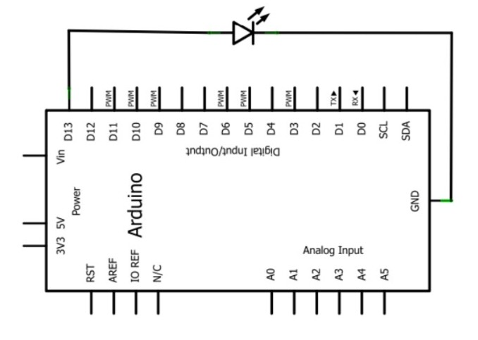

# Proyecto_ Hola mundo—LED intermitente_Arduino

Esta práctica introductoria permite aprender a programar y controlar dispositivos electrónicos. Consiste en hacer que un LED se encienda y apague repetidamente, simulando un parpadeo, generalmente con un intervalo de tiempo definido entre cada cambio de estado. Es el equivalente al "Hola Mundo" en otros lenguajes de programación, mostrando la capacidad básica de interactuar con el hardware.




# Codigo para Arduino
```
#define LedA 13;

void setup() 
{
 pinMode(13,OUTPUT); 
}

void loop() 
{ 
 digitalWrite(LedA,HIGH); 
 delay(1000); // Temporiza un segundo (1s = 1000ms)
 digitalWrite(LedA,LOW); 
 delay(1000); 
}
```
